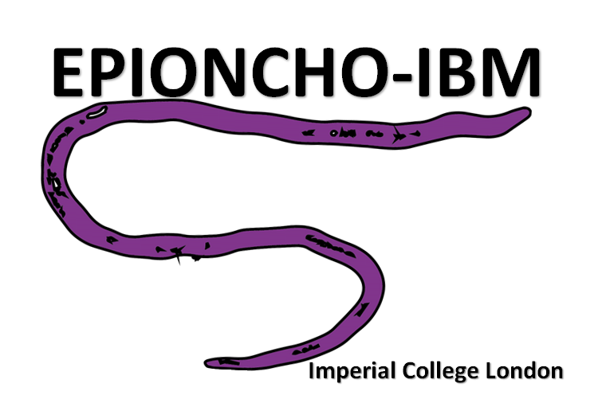

------------------------------------------------------------------------

<!-- badges: start -->
<!-- badges: end -->

 

### An individual-based onchocerciasis dynamic model

------------------------------------------------------------------------

## Overview

A individual-based, stochastic model of the *Onchocerca volvulus*
transmission system.

For full model details please see: [Hamley JID, Milton P, Walker M,
Basáñez M-G (2019) Modelling exposure heterogeneity and density
dependence in onchocerciasis using a novel individual-based transmission
model, EPIONCHO-IBM: Implications for elimination and data needs. PLoS
Negl Trop Dis 13(12):
e0007557](https://doi.org/10.1371/journal.pntd.0007557)

EPIONCHO-IBM has been extended to output Ov16 seroprevalence. This README will describe the `Ov16` branch, and how to recreate the model simulations and analyses published (reference to be inserted after publishing) in Nature Communications. To see the original model, please switch to the `master` branch.

The seroprevalence outputed was determined by testing hypotheses for seroconversion (ranging from prepatent to patent) and seroreversion (ranging from instant seroreversion to lifelong immunity). The model outputs the two best fit hypotheses. While both hypotheses assume seroconversion occurs in the presence of a mating worm pair and the production of any microfilariea, they differ in their seroreversion assumptions, one with lifelong immunity, and the other with finite immunity (seroreversion in the absence of infection, defined as the absence of worms and larvae in a host).
A practical demo can be found in the Running EPIONCHO-IBM Ov16 vignette.

The analysis done in the paper follows the following steps:
1. ABR tuning for Gabon
2. Running simulations for Gabon
3. Analysing simulations for Gabon
4. ABR tuning for Togo
5. Running simulations for Togo
6. Analysing simulations for Togo

Running the full analysis will take a significantly long time, even when done on high performance clusters. To overcome that, the processed data from running the model are already provided. The processed data is stored in the [data](data/) folder. First, download the Gabon data from the following link: https://data.mendeley.com/datasets/vtvmrzs9ch/2. Be sure to save it in the same `data` folder as above. Then, unzip the `model_processed_data.zip`, `model_processed_data.zip`, `analysis_processed_data.zip`, `analysis_processed_data_onchosim.zip`, and `analysis_processed_data_oti_100.zip` files in the `data/` folder. Once this has been completed, you can just run [analysis_for_gabon.Rmd](analysis_files/analysis_for_gabon.Rmd) to reproduce the plots for Gabon. To reproduce the plots for Togo, not additional downloads are necessary, just run [analysis_for_togo.Rmd](analysis_files/analysis_for_togo.Rmd). Note that while you are running the scripts, you may need to provide input (usually typing `1` in the console) to allow the script to create folders for the outputs.

If you want to run the full analysis:

- Step 1: The code for the ABR tuning of Gabon is outlined in step 3.1 of the [Running EPIONCHO-IBM Ov16 vignette](vignettes/Running_EPIONCHO_IBM_Ov16.Rmd). Note that the default iterations per abr in the script is 1, however for the model, 100 was the minimum used, then with the narrowed down ABRs, 500 simulations were run.

- Step 2: Once you have a "final" ABR and kE, you can then run the model itself for Gabon. The code for this is already prepared with the best fitting ABR and kE combination, available at [all_funcs_combined.R](all_funcs_combined.R). To replicate the results from the study, you need to run this 6000 times, each time providing a new iter value from 1-6000. You may need to create the `raw_data/gabon_output/` folder path. To run the same simulations with onchosim exposure, run [all_funcs_combined_onchosim.R](all_funcs_combined_onchosim.R) 6000 times as well, making sure to create the `raw_data/gabon_onchosim_output/` folder path.

- Step 3: Cnce you have the data, you can run [processDataGabon.R](processDataGabon.R) to process the data in a format expected by the analysis code. You will need to run this script twice, once without any changes, and then another changing the input `files` argument to point to `raw_data/gabon_onchosim_output/`, along with changing the folder the data is saved in to `data/onchosim_data/`. Once you have the processed data, you can run [analysis_for_gabon.Rmd](analysis_files/analysis_for_gabon.Rmd) to produce the results for Gabon. To show the comparison between EPIONCHO-IBM exposure and onchosim exposure, please set `use_onchosim = FALSE` first, then re-run with `use_onchosim = TRUE`.

- Step 4: To find the distribution of ABRs for togo, you can re-use much of the code is outlined in step 3.1 of the [Running EPIONCHO-IBM Ov16 vignette](vignettes/Running_EPIONCHO_IBM_Ov16.Rmd), with some minor changes. This will take quite a long time, and the previously determined ABR distributions are already implemented in the model code.
Changes:
Old Code -> New Code
`num_iters_per_abr <- 1` -> `num_iters_per_abr <- 100`
`abr_range_k3 <- seq(170, 179, 5)` -> `abr_range_k3 <- seq(1000, 60000, 500)`
`all_abrs <- c(abrs_k2, abrs_k3)` -> `all_abrs <- abrs_k3`
`kEs = c(rep(0.2, length(abrs_k2)), rep(0.3, length(abrs_k3)))` -> `kEs = rep(0.3, length(abrs_k3))`
Additionally, change `test_output_folder/test_mfp_abr_output_folder/` to a path of your choosing.

Once all the simulations have been run, then 

- Step 5: For the simulations for Togo, the model code to be run is in [all_funcs_combined_togo.R](all_funcs_combined_togo.R). This script needs to be run a total of 13,500 times, each time providing a new iter value from 1-13,500. You may need to create the `raw_data/togo_output/` folder path.

- Step 6: Then once you have the data, you can run [processDataTogo.R](processDataTogo.R) to process the data in a format expected by the analysis code. Once you have the processed data, you can run [analysis_for_togo.Rmd](analysis_files/analysis_for_togo.Rmd) to produce the results for Togo.